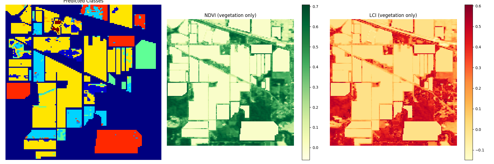

# **Hyperspectral Plant Health Mapping Using CNN and Vegetation Indices**



## 📝 **Project Description**

This project aims to automate the assessment of plant health using hyperspectral imaging. A 1D CNN model is trained to classify each pixel based on spectral signatures, while vegetation indices such as NDVI and LCI are computed for the segmented vegetation areas. The fusion of deep learning and spectral vegetation analysis enables effective plant quality mapping for precision agriculture.

---

## 📂 **Dataset**

- **Indian Pines Dataset**  
  Format: `.npy` arrays  
  - `indianpinearray.npy` – Hyperspectral image (shape: Height × Width × Spectral Bands)  
  - `IPgt.npy` – Ground truth labels (shape: Height × Width)  

You can download the original `.mat` files from the [University of Southern Mississippi dataset page](https://www.ehu.eus/ccwintco/index.php/Hyperspectral_Remote_Sensing_Scenes) and convert them to `.npy`.

---

## ⚙️ **Model Architecture**

- A simple **1D Convolutional Neural Network** (`PixelCNN`) processes pixel spectra independently.
- The network performs:
  - **Two Conv1D layers**
  - **Fully connected layers**
  - **Dropout regularization**
- Model classifies each valid pixel into one of the land cover classes.

---

## 🧠 **Training Details**

- Loss: CrossEntropyLoss  
- Optimizer: Adam  
- Epochs: 100  
- Batch size: 64  
- Stratified 80/20 split for training/testing

---

## 🌿 **Vegetation Indices Computed**

- **NDVI (Normalized Difference Vegetation Index)**  
  $$\text{NDVI} = \frac{\text{NIR} - \text{RED}}{\text{NIR} + \text{RED}}$$

- **LCI (Leaf Chlorophyll Index)**  
  $$\text{LCI} = \frac{\text{NIR} - \text{GREEN}}{\text{NIR} + \text{GREEN}}$$

- NIR Band = 48  
- RED Band = 29  
- GREEN Band = 19  

---

## 📊 **Visualization Output**

- **Left**: Predicted land cover classes  
- **Middle**: NDVI values (vegetation only)  
- **Right**: LCI values (vegetation only)


---

## 💻 **How to Run**

1. Install requirements (PyTorch, NumPy, matplotlib, scikit-learn)
2. Ensure `indianpinearray.npy` and `IPgt.npy` are in the working directory
3. Run the script:
   ```bash
   python model.py
   ```

The script trains the model, evaluates accuracy, computes NDVI/LCI, predicts the entire image, and saves a visualization as `visualization_output.png`.

---

## 🔬 **Use Case**

This method can be adapted for:
- Monitoring crop health
- Detecting plant stress or disease
- Supporting smart farming platforms

---

## 📎 **Files Included**

- `model.py`: End-to-end training, evaluation, and visualization
- `indianpinearray.npy`: Hyperspectral image data (user-provided)
- `IPgt.npy`: Ground truth labels (user-provided)
- `image.png`: Final output visualization
